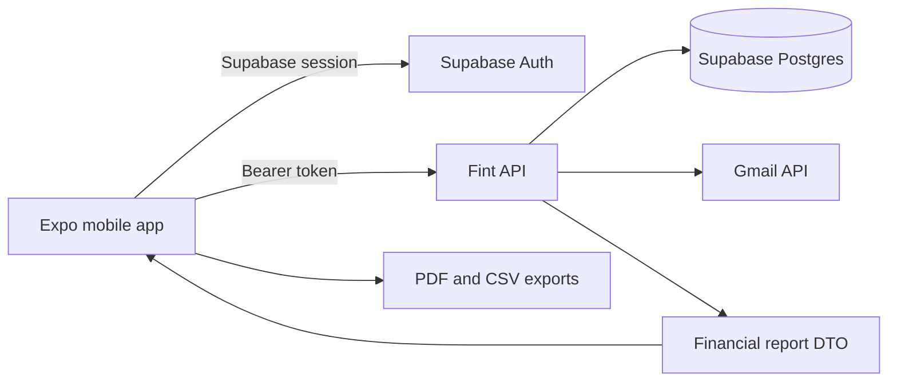

<div align="center">
  

  <p><strong>Organiza cuentas, movimientos, deudas y reportes personales sin perder el control de tus datos.</strong></p>

  <p>
    <a href="https://github.com/maishet/finanzas-mobilev2/blob/main/LICENSE"></a>
    <a href="https://expo.dev"></a>
    <a href="https://reactnative.dev"></a>
    <a href="https://www.typescriptlang.org"></a>
    
  </p>

  <p>
    <a href="#producto">Producto</a> ·
    <a href="#arquitectura">Arquitectura</a> ·
    <a href="#comenzar">Comenzar</a> ·
    <a href="#contribuir">Contribuir</a> ·
    <a href="https://github.com/maishet/finanzas-mobilev2/issues">Issues</a>
  </p>
</div>

---

## Producto

Fint ayuda a construir una vision completa de las finanzas personales desde el telefono. Reune la actividad diaria, la posicion financiera y los reportes de cierre en una experiencia enfocada, accesible y disponible en varios idiomas.

| Organiza | Comprende | Actua |
| --- | --- | --- |
| Cuentas, saldos, movimientos, categorias y deudas. | Dashboard, comparaciones, tendencias y desglose por cuenta o categoria. | Registra operaciones, confirma sugerencias y exporta reportes en PDF o CSV. |

### Capacidades

- **Control financiero:** ingresos, gastos, transferencias, cuentas, categorias y deudas.
- **Reportes accionables:** filtros temporales, comparaciones, evolucion, posicion actual y movimientos destacados.
- **Exportacion portable:** documentos PDF y archivos CSV generados directamente en Android.
- **Gmail opcional:** deteccion de movimientos pendientes con filtros definidos por el usuario y confirmacion obligatoria.
- **Acceso seguro:** sesiones administradas con Supabase Auth y soporte para Google OAuth.
- **Experiencia localizada:** interfaz disponible en espanol, ingles y portugues.
- **Tema adaptable:** modos claro y oscuro con un sistema visual ocean-blue.

> [!IMPORTANT]
> Fint es una herramienta de organizacion financiera personal. No ofrece asesoramiento financiero, bancario, tributario ni de inversion.

## Arquitectura



La aplicacion movil mantiene la presentacion y las interacciones en Expo. La API privada concentra las reglas de negocio y entrega un DTO canonico que alimenta la vista de reportes y sus exportaciones.

### Stack principal

| Capa | Tecnologia |
| --- | --- |
| Mobile | Expo SDK 55, React Native 0.83, Expo Router |
| UI | Tamagui 2, React Native SVG, Reanimated |
| Datos | TanStack Query, Zod, API HTTP privada |
| Identidad | Supabase Auth, Google OAuth, Secure Store |
| Idiomas | i18next, espanol, ingles y portugues |
| Entrega | EAS Build, Android App Bundle, APK interno |

### Estructura

```text
app/                  Rutas y pantallas de Expo Router
src/api/              Cliente HTTP, contratos y mappers
src/auth/             Sesion, autenticacion y rutas iniciales
src/components/       Componentes reutilizables del producto
src/finance/          Reglas financieras, reportes y exportaciones
src/i18n/             Configuracion y traducciones
src/theme/            Tema, tipografia y preferencias visuales
src/ui/               Primitivas del sistema de interfaz
tests/unit/           Pruebas unitarias
docs/                 Producto, operacion y lanzamiento
```

## Comenzar

### Requisitos

- [Bun 1.3.9](https://bun.sh/)
- [Node.js 22](https://nodejs.org/) para builds EAS
- [Expo](https://docs.expo.dev/) y Android Emulator o un dispositivo Android
- Un proyecto Supabase y acceso a una instancia compatible de la API de Fint

### Instalacion

```bash
git clone https://github.com/maishet/finanzas-mobilev2.git
cd finanzas-mobilev2
bun install --frozen-lockfile
```

Crea `.env` a partir de [`.env.example`](.env.example):

```env
EXPO_PUBLIC_API_URL=https://api.example.com
EXPO_PUBLIC_SUPABASE_URL=https://your-project.supabase.co
EXPO_PUBLIC_SUPABASE_ANON_KEY=your-anon-key
EXPO_PUBLIC_PRIVACY_POLICY_URL=https://your-domain.com/privacy
EXPO_PUBLIC_TERMS_URL=https://your-domain.com/terms
```

Configura `finanzasmobilev2://auth/callback` como URL de redireccionamiento en Supabase Auth.

> [!CAUTION]
> Las variables `EXPO_PUBLIC_*` se incluyen en el cliente. Nunca guardes en ellas service-role keys, tokens privados ni secretos de servidor.

### Desarrollo

| Comando | Descripcion |
| --- | --- |
| `bun run start` | Inicia Expo y limpia la cache de Metro. |
| `bun run android` | Compila y ejecuta la aplicacion en Android. |
| `bun run typecheck` | Valida el proyecto con TypeScript. |
| `bun run test` | Ejecuta las pruebas unitarias. |
| `bunx expo-doctor` | Revisa la compatibilidad del proyecto Expo. |
| `bun run build:preview:android` | Genera un APK para pruebas internas. |
| `bun run build:production:android` | Genera un AAB para Google Play. |

## Estado Del Proyecto

Fint se encuentra en preparacion para su primer lanzamiento publico. El flujo principal, los reportes, las exportaciones y la build Android ya fueron validados; el seguimiento restante esta documentado en el [checklist de lanzamiento](docs/release-checklist-prioritized.md).

- [Vision de producto](docs/fint-product-vision.md)
- [Roadmap del MVP](docs/mvp-phases-roadmap.md)
- [Plan de pendientes y pagos recurrentes](docs/implementation-plan-pending-and-payments.md)
- [Preparacion para lanzamiento](docs/launch-readiness.md)
- [Guia de Play Store](docs/play-store-launch.md)
- [Monitoreo y operaciones](docs/monitoring-setup.md)

## Contribuir

Las contribuciones que mejoren la calidad, accesibilidad, privacidad o experiencia financiera de Fint son bienvenidas. Antes de comenzar un cambio grande, abre un [issue](https://github.com/maishet/finanzas-mobilev2/issues) para acordar el alcance.

Lee [CONTRIBUTING.md](CONTRIBUTING.md) para conocer el flujo de trabajo, las validaciones requeridas y los terminos aplicables a las contribuciones.

## Contribuidores

<a href="https://github.com/maishet/finanzas-mobilev2/graphs/contributors">
  
</a>

Las contribuciones aparecen automaticamente cuando GitHub actualiza el historial publico del repositorio.

## Seguridad Y Privacidad

Fint maneja informacion financiera sensible. No publiques vulnerabilidades, credenciales ni datos personales en issues abiertos. Consulta [SECURITY.md](SECURITY.md) para reportar un problema de forma responsable.

La integracion de Gmail es opcional y no crea movimientos de manera automatica. Toda sugerencia requiere confirmacion explicita del usuario.

## Licencia

El codigo de este repositorio se distribuye bajo la [Apache License 2.0](LICENSE).

```text
Copyright 2026 Cristhofer Moises Ventura Villanueva
```

Apache 2.0 permite usar, modificar y distribuir el codigo, incluye una concesion expresa de patentes y exige conservar los avisos aplicables. La licencia no concede derechos sobre los nombres, logotipos o marcas de Fint.

---

<div align="center">
  <sub>Construido con Expo, React Native y una obsesion saludable por la claridad financiera.</sub>
</div>
